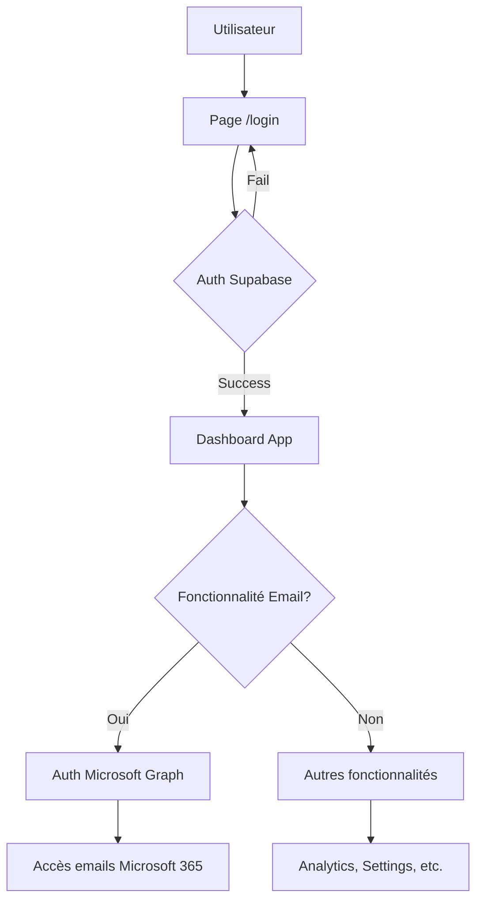

# Architecture d'Authentification Duale

Date: 2025-09-08  
Statut: ✅ Implémenté

## Concept : Deux Authentifications Distinctes

L'application utilise **deux systèmes d'authentification séparés** avec des rôles différents :

### 🔐 **1. Authentification Supabase** (Accès Application)
- **Rôle** : Accès à l'application Email Tracking
- **Localisation** : Page `/login` 
- **Méthode** : Email + Mot de passe
- **Obligatoire** : ✅ Pour utiliser l'application

### 📧 **2. Authentification Microsoft Graph** (Fonctionnalité Emails)
- **Rôle** : Accès aux emails Microsoft 365
- **Localisation** : Dans l'application (composants intégrés)
- **Méthode** : OAuth Microsoft
- **Optionnelle** : ⚠️ Nécessaire pour les fonctionnalités email

## Architecture Détaillée

### **Flow d'Authentification**



### **Séparation des Responsabilités**

| Authentification | Supabase | Microsoft Graph |
|------------------|----------|------------------|
| **Purpose** | Application access | Email functionality |
| **Required** | ✅ Always | ⚠️ For email features |
| **Location** | `/login` page | Inside app components |
| **Scope** | App permissions | Microsoft 365 emails |
| **Storage** | Supabase session | OAuth tokens in Supabase |
| **Logout** | Full app logout | Email features only |

## Page de Connexion Supabase

### 🎨 **Design Moderne avec shadcn/ui**

**Composants utilisés** :
- `Card` avec shadow et gradients
- `Input` et `Label` avec icônes
- `Button` avec états hover/focus
- Messages d'erreur intégrés
- Features highlights

**Fonctionnalités** :
- ✅ **Connexion** email/password
- ✅ **Inscription** nouveau compte
- ✅ **Messages d'erreur** contextuels
- ✅ **Design responsive** mobile-first
- ✅ **Accessibilité** WCAG compliant

### 📝 **Formulaire d'Authentification**

```tsx
<form className="space-y-6">
  <Input
    name="email"
    type="email"
    placeholder="votre@email.com"
  />
  <Input
    name="password"
    type="password"
    placeholder="••••••••"
  />
  
  <div className="flex space-x-3">
    <Button formAction={login}>Se connecter</Button>
    <Button formAction={signup} variant="outline">S'inscrire</Button>
  </div>
</form>
```

### ✨ **Actions Serveur**

```typescript
// app/login/actions.ts
export async function login(formData: FormData) {
  const supabase = await createClient()
  const { error } = await supabase.auth.signInWithPassword(data)
  
  if (!error) redirect('/dashboard')
}

export async function signup(formData: FormData) {
  const supabase = await createClient()
  const { error } = await supabase.auth.signUp(data)
  
  if (!error) redirect('/dashboard')
}
```

## Intégration Microsoft Graph

### 🔗 **Dans l'Application**

L'authentification Microsoft se fait **après** connexion Supabase via :

1. **Composants intégrés** dans le dashboard
2. **Boutons de connexion** Microsoft 365  
3. **Workflows** automatiques pour email tracking
4. **Paramètres** utilisateur pour gérer la connexion

**Exemples d'intégration** :
- `components/microsoft-connect-button.tsx`
- Dashboard settings page
- Email composition flow
- Webhook configuration

### 🎯 **User Experience**

**Étapes utilisateur** :
1. **Se connecter** à l'app (Supabase) → `/login`
2. **Accéder au dashboard** → Fonctionnalités de base disponibles
3. **Utiliser fonctionnalité email** → Prompt connexion Microsoft
4. **Autoriser Microsoft 365** → Accès complet aux emails
5. **Utiliser l'app** → Toutes fonctionnalités disponibles

## Messages et Communication

### **Page de Connexion**

**Footer explicatif** :
> "L'authentification Microsoft sera demandée dans l'application"

**Messages clairs** :
- ✅ "Authentification sécurisée avec chiffrement"
- ✅ Technology badges : "Supabase Auth", "Sécurisé"
- ✅ Features : "Tracking temps réel", "Détection automatique"

### **Dans l'Application**

**Prompts contextuels** :
- "Connectez-vous à Microsoft 365 pour accéder à vos emails"
- "Configuration Microsoft Graph requise pour le tracking"
- "Autorisez l'accès pour envoyer des emails trackés"

## Avantages de cette Architecture

### 🔒 **Sécurité**
- **Séparation des préoccupations** : App auth ≠ Email auth
- **Permissions granulaires** : Accès Microsoft seulement si nécessaire
- **Révocation sélective** : Peut déconnecter Microsoft sans perdre l'app

### 🎯 **UX/UI**
- **Onboarding progressif** : Commence simple, complexité graduée
- **Fonctionnalités par étapes** : Utilisateur peut explorer avant email setup
- **Clarté** : Rôle de chaque auth bien défini

### 🛠️ **Développement**
- **Modularité** : Auth systems découplés
- **Maintenance** : Changement d'un système n'affecte pas l'autre
- **Testing** : Peut tester app auth sans Microsoft setup

## Exemples d'Usage

### **Utilisateur Nouveau**
1. Découvre l'app → S'inscrit via Supabase
2. Explore dashboard → Voit les fonctionnalités
3. Veut tracker emails → Connexion Microsoft demandée
4. Autorise → Accès complet

### **Utilisateur Existant**
1. Se connecte via Supabase
2. Microsoft déjà autorisé → Accès direct
3. Utilise toutes les fonctionnalités

### **Utilisateur Pro (Microsoft uniquement)**
1. Se connecte via Supabase
2. Utilise seulement analytics → Pas besoin Microsoft
3. Dashboard, settings, rapports disponibles

## Comparaison avec Autres Approches

### **❌ Auth Unique Microsoft**
- Problème : Force Microsoft pour tout
- Problème : Pas d'accès sans Microsoft 365
- Problème : Coupling trop fort

### **❌ Auth Unique Supabase**
- Problème : Pas d'accès emails
- Problème : Fonctionnalité limitée
- Problème : Pas de Microsoft Graph

### **✅ Auth Duale (Notre Approche)**
- ✅ Flexibilité maximale
- ✅ UX progressive
- ✅ Fonctionnalités modulaires
- ✅ Sécurité granulaire

## Configuration et Déploiement

### **Variables d'Environnement**

```bash
# Supabase (Application Auth)
NEXT_PUBLIC_SUPABASE_URL=
NEXT_PUBLIC_SUPABASE_ANON_KEY=
SUPABASE_SERVICE_ROLE_KEY=

# Microsoft Graph (Email Features)  
AZURE_AD_CLIENT_ID=
AZURE_AD_CLIENT_SECRET=
AZURE_AD_TENANT_ID=
```

### **Navigation Conditionnelle**

La navigation s'adapte selon l'état d'authentification :
- **Non connecté** : Navigation masquée
- **Supabase connecté** : Navigation complète
- **Microsoft connecté** : Statut dans navigation

Cette architecture offre la **meilleure UX** avec une séparation claire des responsabilités entre authentification application et fonctionnalités email.