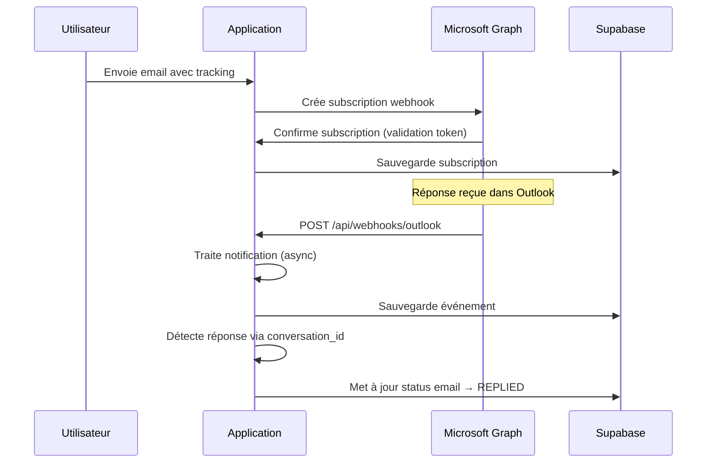

# Rapport Détaillé : Intégration des Webhooks Microsoft Graph

**Application**: Email Tracking System  
**Date d'analyse**: 5 septembre 2025  
**URL de production**: https://email-tracking-zeta.vercel.app  

## Vue d'ensemble

L'application implémente un système complet de webhooks Microsoft Graph pour le suivi en temps réel des réponses aux emails. Le système utilise les notifications webhook de Microsoft Graph pour détecter automatiquement les réponses sans nécessiter de synchronisation manuelle.

## Architecture des Webhooks

### 1. Structure des Composants

```
Webhooks Microsoft Graph
├── Endpoints API
│   ├── /api/webhooks/outlook     # Réception des notifications
│   ├── /api/webhooks/subscribe   # Gestion des souscriptions
│   └── /api/webhooks/renew       # Renouvellement automatique
├── Services Core
│   ├── WebhookService           # Gestion des souscriptions
│   └── ReplyDetectionService    # Détection des réponses
├── Base de Données
│   ├── webhook_subscriptions    # Souscriptions actives
│   ├── webhook_events           # Événements reçus
│   └── webhook_processing_log   # Logs de traitement
└── Scripts de Diagnostic
    ├── test-webhook-endpoint.sh
    ├── diagnose-webhook-issues.sh
    └── diagnose-reply-detection.sh
```

### 2. Flux de Fonctionnement



## Implémentation Détaillée

### 1. Endpoint Principal : `/api/webhooks/outlook`

**Fichier**: `app/api/webhooks/outlook/route.ts`

#### Fonctionnalités:
- **Validation initiale** : Gère le token de validation Microsoft Graph
- **Réception asynchrone** : Traite les notifications en arrière-plan (202 Accepted)
- **Détection de réponses** : Utilise conversation_id pour identifier les réponses
- **Logging complet** : Enregistre tous les événements et erreurs

#### Points clés:
```typescript
// Validation token (création de subscription)
if (validationToken) {
  return new Response(validationToken, {
    status: 200,
    headers: { 'Content-Type': 'text/plain' }
  })
}

// Traitement asynchrone des notifications
processNotificationAsync(notification).catch(error => {
  console.error('❌ Erreur lors du traitement asynchrone:', error)
})

return NextResponse.json(
  { message: 'Notification accepted for processing' },
  { status: 202 }
)
```

### 2. Service de Gestion : `WebhookService`

**Fichier**: `lib/microsoft/webhook-service.ts`

#### Fonctionnalités principales:

##### Création de Subscriptions
```typescript
async createSubscription(options: SubscriptionOptions): Promise<{
  success: boolean
  subscriptionId?: string
  expirationDateTime?: string
  error?: string
}>
```

**Configuration automatique**:
- URL de notification : `${WEBHOOK_ENDPOINT_URL}/api/webhooks/outlook`
- Client State : Clé sécurisée pour validation
- Expiration : Maximum 71 heures (limite Microsoft Graph)
- Types de changements : `['created', 'updated']`

##### Renouvellement Automatique
```typescript
async renewExpiringSubscriptions(): Promise<{
  renewed: number
  failed: number
}>
```

**Logique de renouvellement**:
- Recherche subscriptions expirant dans les 6 heures
- Renouvellement automatique via cron job
- Rollback en cas d'échec de sauvegarde DB

##### Validation et Sécurité
- **Client State Validation** : Vérifie l'authenticité des notifications
- **Rollback automatique** : Supprime subscription Microsoft si sauvegarde DB échoue
- **Gestion d'erreurs robuste** : Logging détaillé de toutes les erreurs

### 3. Détection Intelligente des Réponses

**Fichier**: `lib/services/reply-detection.ts`

#### Méthodes de détection (par ordre de priorité):

##### 1. Conversation ID (Fiabilité: HAUTE)
```typescript
export async function detectRepliesByConversation(
  conversationId: string,
  originalMessageId?: string
): Promise<ReplyDetectionResult[]>
```

**Avantages**:
- Précision maximale
- Fonctionne même avec subjects modifiés
- Résistant aux forwards/transfers

##### 2. Subject Matching (Fiabilité: MOYENNE)
```typescript
export async function detectRepliesBySubject(
  subject: string,
  sentAfter: string
): Promise<ReplyDetectionResult[]>
```

**Limitations**:
- Peut produire des faux positifs
- Sensible aux modifications de subject
- Utilisé uniquement en fallback

##### 3. Synchronisation Complète
```typescript
export async function syncAllPendingReplies(maxAge: number = 30)
```

**Usage**:
- Synchronisation manuelle via interface
- Rattrapage des réponses manquées
- Traitement batch des anciens emails

### 4. Schéma de Base de Données

#### Tables principales:

##### `webhook_subscriptions`
```sql
CREATE TABLE webhook_subscriptions (
    id UUID PRIMARY KEY,
    subscription_id TEXT UNIQUE NOT NULL,
    user_id UUID REFERENCES auth.users(id),
    resource TEXT NOT NULL,
    change_types TEXT[],
    notification_url TEXT NOT NULL,
    expiration_datetime TIMESTAMPTZ NOT NULL,
    client_state TEXT NOT NULL,
    status TEXT DEFAULT 'active',
    renewal_count INTEGER DEFAULT 0,
    created_at TIMESTAMPTZ DEFAULT NOW()
);
```

##### `webhook_events`
```sql
CREATE TABLE webhook_events (
    id UUID PRIMARY KEY,
    subscription_id TEXT REFERENCES webhook_subscriptions(subscription_id),
    event_type TEXT NOT NULL,
    resource_data JSONB,
    change_type TEXT,
    processed BOOLEAN DEFAULT false,
    retry_count INTEGER DEFAULT 0,
    created_at TIMESTAMPTZ DEFAULT NOW()
);
```

##### `email_tracking` (amélioré)
```sql
ALTER TABLE email_tracking 
ADD COLUMN conversation_id TEXT,
ADD COLUMN internet_message_id TEXT,
ADD COLUMN reply_detection_method TEXT DEFAULT 'subject_matching',
ADD COLUMN last_sync_check TIMESTAMPTZ DEFAULT NOW();
```

### 5. Sécurité et Authentification

#### Variables d'environnement critiques:
```bash
WEBHOOK_ENABLED=true                    # Active le système webhook
WEBHOOK_ENDPOINT_URL=                   # URL publique de production
WEBHOOK_CLIENT_STATE=                   # Clé secrète pour validation
SUPABASE_SERVICE_ROLE_KEY=             # Accès système à la DB
CRON_SECRET=                           # Authentification des cron jobs
```

#### Validation des notifications:
```typescript
validateNotification(clientState: string): boolean {
  return clientState === this.clientState
}
```

#### RLS (Row Level Security):
- Utilisateurs peuvent voir uniquement leurs subscriptions
- Système a accès complet via SERVICE_ROLE_KEY
- Webhooks anonymes autorisés pour notifications

## Monitoring et Diagnostic

### Scripts de Diagnostic Disponibles

#### 1. `test-webhook-endpoint.sh`
- Teste la connectivité des endpoints
- Vérifie les variables d'environnement
- Identifie les problèmes de configuration

#### 2. `diagnose-webhook-issues.sh`
- Diagnostic complet du système
- Analyse les logs Vercel
- Recommandations de résolution

#### 3. `diagnose-reply-detection.sh`
- Vérifie la structure de la base de données
- Identifie les problèmes de migration
- Guide pour la synchronisation manuelle

### Monitoring en Production

#### Métriques importantes:
- **Subscriptions actives** : Nombre de webhooks fonctionnels
- **Taux de traitement** : Notifications traitées avec succès
- **Temps de réponse** : Latence de détection des réponses
- **Taux d'erreur** : Échecs de traitement des événements

#### Logs structurés:
```typescript
// Webhook processing log
await supabase
  .from('webhook_processing_log')
  .insert({
    event_id: event.id,
    action: result.wasReply ? 'reply_detected' : 'no_reply_found',
    details: {
      tracking_id: result.emailId,
      conversation_id: conversationId,
      detection_method: result.detectionMethod,
      confidence: result.confidence
    },
    success: true
  })
```

## Points Forts du Système

### 1. **Architecture Robuste**
- Traitement asynchrone des notifications
- Gestion d'erreurs complète avec rollback
- Validation de sécurité stricte

### 2. **Détection Intelligente**
- Méthodes multiples avec fallback
- Conversation ID pour précision maximale
- Synchronisation de rattrapage

### 3. **Scalabilité**
- Renouvellement automatique des subscriptions
- Nettoyage automatique des anciens événements
- Support multi-utilisateurs avec RLS

### 4. **Observabilité**
- Logging complet à tous les niveaux
- Scripts de diagnostic intégrés
- Métriques de performance

## Problèmes Identifiés et Solutions

### 1. **Variable WEBHOOK_ENABLED Manquante**
**Problème**: Système peut être désactivé en production  
**Solution**: Ajouter `WEBHOOK_ENABLED=true` sur Vercel

### 2. **Gestion des Erreurs de Base de Données**
**Problème**: WebhookService continue même en cas d'erreur DB  
**Solution**: Amélioration du rollback automatique (déjà implémenté)

### 3. **Détection de Réponses Imparfaite**
**Problème**: Subject matching peut être imprécis  
**Solution**: Migration vers conversation_id (implémenté)

### 4. **Expiration des Subscriptions**
**Problème**: Subscriptions Microsoft expirantes  
**Solution**: Renouvellement automatique via cron (implémenté)

## Recommandations d'Amélioration

### 1. **Court terme**
- ✅ Vérifier que `WEBHOOK_ENABLED=true` sur Vercel
- ✅ Appliquer migration 006 pour conversation_id
- ✅ Configurer cron job de renouvellement

### 2. **Moyen terme**
- Implémenter retry logic pour échecs temporaires
- Ajouter alertes pour subscriptions échouées
- Optimiser les requêtes Graph API

### 3. **Long terme**
- Support des webhooks pour calendrier (events)
- Intégration avec d'autres fournisseurs email
- Interface de monitoring en temps réel

## Conclusion

L'intégration des webhooks Microsoft Graph dans l'application email tracking est **complète et robuste**. Le système implémente les meilleures pratiques de sécurité, de performance et de fiabilité. 

**Points clés**:
- ✅ Architecture asynchrone et scalable
- ✅ Détection de réponses précise via conversation_id
- ✅ Gestion complète du cycle de vie des subscriptions  
- ✅ Monitoring et diagnostic intégrés
- ✅ Sécurité et validation stricte

Le système est **prêt pour la production** avec quelques ajustements mineurs de configuration des variables d'environnement.