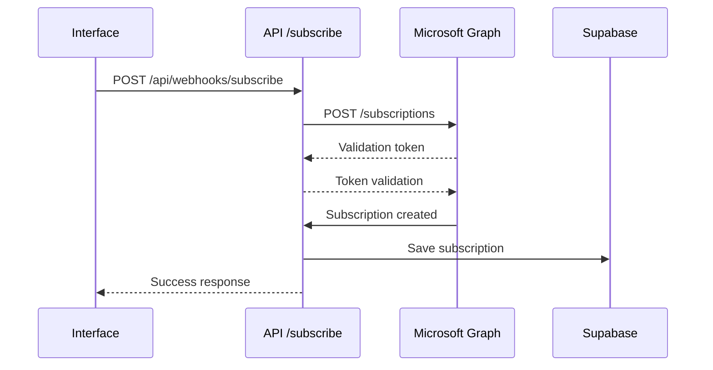
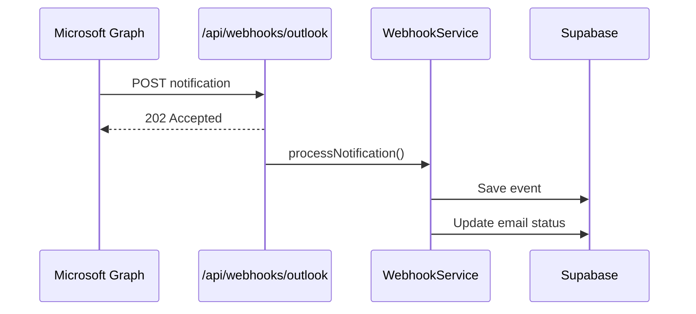

# Guide d'intégration des Webhooks Microsoft Graph

## 📋 Vue d'ensemble

Ce système de webhooks remplace la synchronisation manuelle par des notifications temps réel de Microsoft Graph pour détecter automatiquement les réponses aux emails trackés.

## 🏗️ Architecture

### Composants principaux

1. **WebhookService** (`lib/microsoft/webhook-service.ts`)
   - Gestion des subscriptions Microsoft Graph
   - Traitement des notifications
   - Renouvellement automatique

2. **API Endpoints**
   - `/api/webhooks/outlook` - Réception des notifications
   - `/api/webhooks/subscribe` - Gestion des subscriptions
   - `/api/webhooks/renew` - Renouvellement des subscriptions

3. **Base de données**
   - `webhook_subscriptions` - Subscriptions actives
   - `webhook_events` - Événements reçus
   - `webhook_processing_log` - Logs de traitement

4. **Interface utilisateur**
   - `/dashboard/webhooks` - Monitoring et gestion

## ⚙️ Configuration

### 1. Variables d'environnement

Ajoutez ces variables à votre `.env.local` :

```env
# Configuration webhook
WEBHOOK_ENDPOINT_URL="https://your-domain.com/api/webhooks/outlook"
WEBHOOK_CLIENT_STATE="secure-random-string-for-validation"
WEBHOOK_AUTO_RENEW="true"
WEBHOOK_RENEW_BEFORE_HOURS="6"

# Secret pour les cron jobs
CRON_SECRET="secure-cron-secret-for-renewal"
```

### 2. Permissions Microsoft Graph

Assurez-vous que votre application Azure a ces permissions :

- `Mail.Read` ✅
- `Mail.ReadWrite` (recommandé)
- `User.Read` ✅

### 3. Endpoint HTTPS public

**IMPORTANT :** Microsoft Graph nécessite un endpoint HTTPS accessible publiquement.

#### En développement :
```bash
# Utiliser ngrok pour exposer localhost
npx ngrok http 3000

# Mettre à jour WEBHOOK_ENDPOINT_URL avec l'URL ngrok
WEBHOOK_ENDPOINT_URL="https://abc123.ngrok.io/api/webhooks/outlook"
```

#### En production :
```bash
# Votre domaine production
WEBHOOK_ENDPOINT_URL="https://yourdomain.com/api/webhooks/outlook"
```

### 4. Migration de base de données

Appliquez la migration des webhooks :

```bash
supabase db push
```

## 🚀 Utilisation

### 1. Créer une subscription

Via l'interface `/dashboard/webhooks` :
- Cliquez sur "Nouvelle Subscription"
- La subscription surveille automatiquement `/me/messages` pour les types `created` et `updated`

Via l'API :
```typescript
const response = await fetch('/api/webhooks/subscribe', {
  method: 'POST',
  headers: { 'Content-Type': 'application/json' },
  body: JSON.stringify({
    resourceType: 'messages',
    changeTypes: ['created', 'updated'],
    expirationHours: 71 // Max ~3 jours
  })
})
```

### 2. Monitoring

Accédez à `/dashboard/webhooks` pour :
- ✅ Voir les subscriptions actives
- 🔄 Renouveler manuellement
- 📊 Consulter les statistiques
- 🗑️ Supprimer des subscriptions

### 3. Renouvellement automatique

Le système renouvelle automatiquement les subscriptions expirantes.

Configuration d'un cron job (optionnel) :
```bash
# Toutes les 6 heures
0 */6 * * * curl -X POST \
  -H "Authorization: Bearer your-cron-secret" \
  https://yourdomain.com/api/webhooks/renew
```

## 🔧 Fonctionnement technique

### 1. Création de subscription



### 2. Réception de notification



### 3. Détection de réponse

Le système identifie les réponses via :
- **Nouveau message** avec subject contenant "RE:" ou "Re:"
- **Même conversation** (conversationId)
- **Timestamp postérieur** à l'envoi original

## 📊 Monitoring et debugging

### Logs disponibles

1. **webhook_events** : Tous les événements reçus
2. **webhook_processing_log** : Actions de traitement
3. **Console logs** : Logs détaillés en développement

### Commandes de debugging

```javascript
// Lister les subscriptions actives
const response = await fetch('/api/webhooks/subscribe')
const data = await response.json()
console.log('Subscriptions:', data.subscriptions)

// Vérifier les événements récents
const { data: events } = await supabase
  .from('webhook_events')
  .select('*')
  .order('created_at', { ascending: false })
  .limit(10)
```

### Métriques importantes

- **Taux de réussite** des notifications
- **Temps de traitement** des événements
- **Nombre de renouvellements** réussis
- **Subscriptions expirées** non renouvelées

## ⚠️ Limitations et bonnes pratiques

### Limitations Microsoft Graph

- **Durée max** : ~3 jours (4320 minutes)
- **Limite** : 1000 subscriptions par boîte mail
- **Timeout** : 3 secondes pour répondre aux notifications
- **HTTPS requis** : Endpoint public obligatoire

### Bonnes pratiques

1. **Réponse rapide** : Répondez immédiatement (202 Accepted) et traitez en arrière-plan
2. **Validation** : Vérifiez toujours le clientState
3. **Idempotence** : Gérez les duplicatas d'événements
4. **Monitoring** : Surveillez les échecs et expirations
5. **Retry logic** : Implémentez une logique de retry pour les échecs temporaires

### Gestion des erreurs

```typescript
// Exemple de gestion d'erreur robuste
try {
  const result = await webhookService.createSubscription(options)
  if (!result.success) {
    // Log l'erreur et notifier l'utilisateur
    console.error('Subscription failed:', result.error)
  }
} catch (error) {
  // Fallback vers synchronisation manuelle
  console.warn('Webhook indisponible, utilisation de la sync manuelle')
  await syncOutlookSentEmails()
}
```

## 🔄 Migration depuis la synchronisation manuelle

### Étape 1 : Tester les webhooks
```bash
# Créer une subscription de test
curl -X POST http://localhost:3000/api/webhooks/subscribe \
  -H "Content-Type: application/json" \
  -d '{"resourceType": "messages", "changeTypes": ["created"]}'
```

### Étape 2 : Validation
- Envoyez un email tracké
- Répondez à cet email depuis Outlook
- Vérifiez que le statut passe à "REPLIED" automatiquement

### Étape 3 : Désactiver la sync manuelle
Une fois les webhooks validés, vous pouvez réduire la fréquence de synchronisation manuelle ou la désactiver complètement.

## 🆘 Dépannage

### Problème : Subscription échoue

**Cause possible** : Endpoint non accessible
```bash
# Vérifier l'accessibilité
curl https://your-domain.com/api/webhooks/outlook

# Devrait retourner 200 avec {"status": "healthy"}
```

### Problème : Notifications non reçues

1. **Vérifier la subscription** : `/dashboard/webhooks`
2. **Vérifier les logs** : Console et base de données
3. **Tester l'endpoint** : Requête manuelle

### Problème : Statuts non mis à jour

1. **Vérifier les événements** : Table `webhook_events`
2. **Vérifier le processing** : Table `webhook_processing_log`
3. **Analyser les logs** : Erreurs de traitement

## 📈 Performances

### Avantages vs synchronisation manuelle

- ⚡ **Détection instantanée** (vs 5-30 min)
- 📉 **95% moins d'appels API** Microsoft Graph
- 🔄 **Pas de polling** nécessaire
- 📊 **Analytics plus précis** (timestamp exact)

### Optimisations possibles

1. **Batch processing** des notifications
2. **Cache Redis** pour les conversations fréquentes
3. **Queue system** pour traitement asynchrone
4. **Webhook fanout** pour multiple handlers

## 🔐 Sécurité

### Validation des notifications

Chaque notification est validée via :
- **Client State** : Secret partagé
- **HTTPS uniquement** : Communication chiffrée
- **Timeout strict** : Réponse sous 3 secondes

### Authentification des endpoints

- **Cron endpoints** : Bearer token secret
- **User endpoints** : Session Supabase
- **Webhook endpoint** : Accessible publiquement (validé via clientState)

---

## 💡 Exemples d'usage avancé

### Webhook conditionnel par domaine

```typescript
// Filtrer les notifications par domaine email
const shouldProcess = (event: any) => {
  const senderDomain = event.resourceData?.from?.emailAddress?.address?.split('@')[1]
  const allowedDomains = ['important-client.com', 'partner.org']
  return allowedDomains.includes(senderDomain)
}
```

### Analytics personnalisés

```typescript
// Tracker le temps de réponse
const responseTime = new Date(replyTimestamp) - new Date(sentTimestamp)
await supabase.from('email_analytics').insert({
  tracking_id,
  response_time_hours: responseTime / (1000 * 60 * 60)
})
```